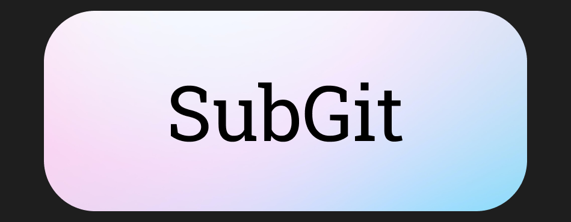
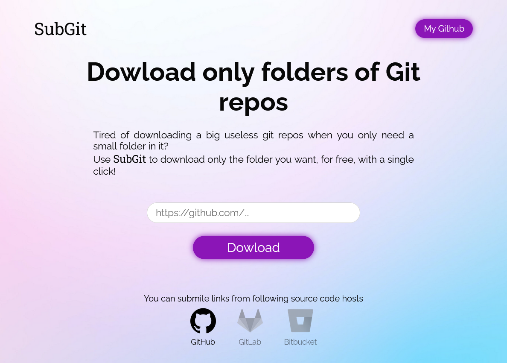

# SubGit

<div align="center">
    
</div>

[SubGit](https://subgit.netlify.app/) is a website to download only a folder from a GitHub repository, as a ZIP file, since it's not possible natively.  
It's really useful on big repos, such as [Prisma examples repo](https://github.com/prisma/prisma-examples/tree/latest/typescript), to download only the example project you are interested in.

## Architecture

### Client 

The client is a basic landing page, written in HTML, SCSS and JavaScript.  
It's built with [Vite](https://vitejs.dev/), and deployed with [Netlify](https://netlify.com/).



Its use is pretty straight forward. You just have to past the link to the repo's directory you would like to download in the input and click on the 'Download' button to get the zip file of this directory.

### Server

The backend is a Node.js server, written in TypeScript and deployed with [Fly.io](https://fly.io/)

You can access it through this url: 
```
https://subgit-server.fly.dev/dowload?url=<DIR_URL>
```

## License

MIT © [Yohan PERROT](https://github.com/yPerrot)